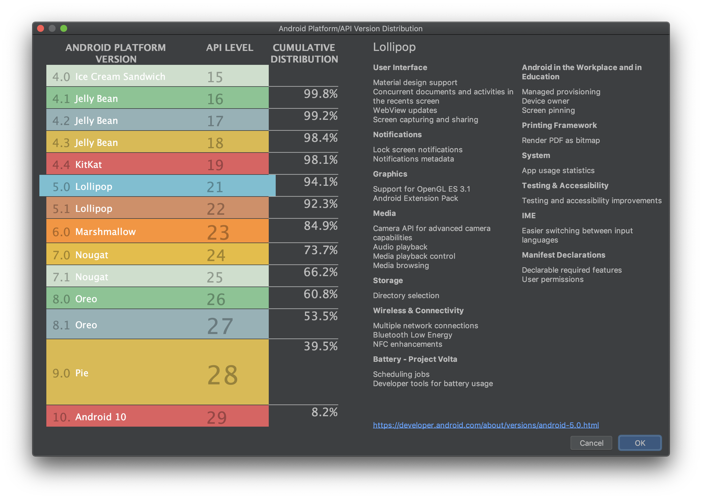

# Android API Major Changes

## An approach to solve system design within 1 hour


## Android Version / Nickname / API number
- Android 6.0 (Marshmallow) - API 23
- Android 7.0 (Nougat) - API 24
- Android 7.1 (Nougat) - API 25
- Android 8.0 (Oreo) - API 26
- Android 8.1 (Oreo) - API 27
- Android 9.0 (Pie) - API 28
- Android 10.0 - API 29
- Android 11.0 - API 30

## Android API Major Behavior Changes
### Android 6.0 (Marshmallow) - API 23 [1]
- Fingerprint Authentication support
- Runtime Permissions
- Doze(maintenance window - 10 secs) and App Standby
- Apache HTTP Client Removal
- Use Notification.Builder
 
### Android 7.0 (Nougat) - API 24
- Multi-window Support
- Doze on the Go...
- Sharing Files Between Apps (content:// instead of file://)

### Android 7.1 (Nougat) - API 25
- App Shortcuts

### Android 8.0 (Oreo) - API 26
- Picture-in-Picture mode
- Notifications Channel
- Background execution limits
    - Background Service Limitations: While an app is idle, there are limits to its use of background services. This does not apply to foreground services, which are more noticeable to the user. c.f Work-around: WorkManger(JobScheduler), Foreground Service    
    - A background app is placed on a temporary allowlist for several minutes under certain circumstances
        - Handling a high-priority Firebase Cloud Messaging (FCM) message.
        - Receiving a broadcast, such as an SMS/MMS message.
        - Executing a PendingIntent from a notification.
        - Starting a VpnService before the VPN app promotes itself to the foreground.
        
    - Broadcast Limitations: With limited exceptions, apps cannot use their manifest to register for implicit broadcasts. They can still register for these broadcasts at runtime, and they can use the manifest to register for explicit broadcasts targeted specifically at their app.
    Only allows explicit broadcast  
- Background Location Limits
    - You can retrieve location updates more frequently by performing one of the following actions:
        - Bring your app to the foreground.
        - Start a foreground service in your app by calling startForegroundService(). When such a foreground service is active, it appears as an ongoing notification in the notification area.
        - Use elements of the Geofencing API, such as the GeofencingClient, which are optimized for minimizing power use.
        - A batched version of Fused Location Provider  

### Android 9.0 (Pie) - API 28
- Power management
    - App Standby Buckets: Design properly in order that a user can launch the app like actionable notification
        - Active
        - Working set
        - Frequent
        - Rare
        - Never
    - Battery saver improvements
    
### Android 10.0 - API 29
- External storage access scoped to app files and media
- Access to device location in the background requires permission: the ACCESS_BACKGROUND_LOCATION permission only affects an app's access to location when it runs in the background.
- Foreground location
    ```<!-- Recommended for Android 9 (API level 28) and lower. -->
      <!-- Required for Android 10 (API level 29) and higher. -->
      <service
          android:name="MyNavigationService"
          android:foregroundServiceType="location" ... >
          <!-- Any inner elements would go here. -->
      </service>
    ```
- Background location (should be incremental request)
    ```<manifest>
        <!-- Required only when requesting background location access on
             Android 10 (API level 29) and higher. -->
        <uses-permission android:name="android.permission.ACCESS_BACKGROUND_LOCATION" />
      </manifest>
      ```
      
### Android 11.0 - API 30
- Device controls, Media controls
- Conversion: Chat bubbles
- Privacy
    - Scoped storage enforcement
    - One-time permissions: Starting in Android 11, whenever your app requests a permission related to location, microphone, or camera, the user-facing permissions dialog contains an option called Only this time.
    - Permissions auto-reset
    - Foreground versus Background location access (Allow only while using app/Allow all the time)  
    
License
-------
MIT License

Copyright (c) 2020 Daehee Han

Permission is hereby granted, free of charge, to any person obtaining a copy
of this software and associated documentation files (the "Software"), to deal
in the Software without restriction, including without limitation the rights
to use, copy, modify, merge, publish, distribute, sublicense, and/or sell
copies of the Software, and to permit persons to whom the Software is
furnished to do so, subject to the following conditions:

The above copyright notice and this permission notice shall be included in all
copies or substantial portions of the Software.

THE SOFTWARE IS PROVIDED "AS IS", WITHOUT WARRANTY OF ANY KIND, EXPRESS OR
IMPLIED, INCLUDING BUT NOT LIMITED TO THE WARRANTIES OF MERCHANTABILITY,
FITNESS FOR A PARTICULAR PURPOSE AND NONINFRINGEMENT. IN NO EVENT SHALL THE
AUTHORS OR COPYRIGHT HOLDERS BE LIABLE FOR ANY CLAIM, DAMAGES OR OTHER
LIABILITY, WHETHER IN AN ACTION OF CONTRACT, TORT OR OTHERWISE, ARISING FROM,
OUT OF OR IN CONNECTION WITH THE SOFTWARE OR THE USE OR OTHER DEALINGS IN THE
SOFTWARE.

[1]:https://developer.android.com/about/versions/marshmallow/android-6.0-changes
